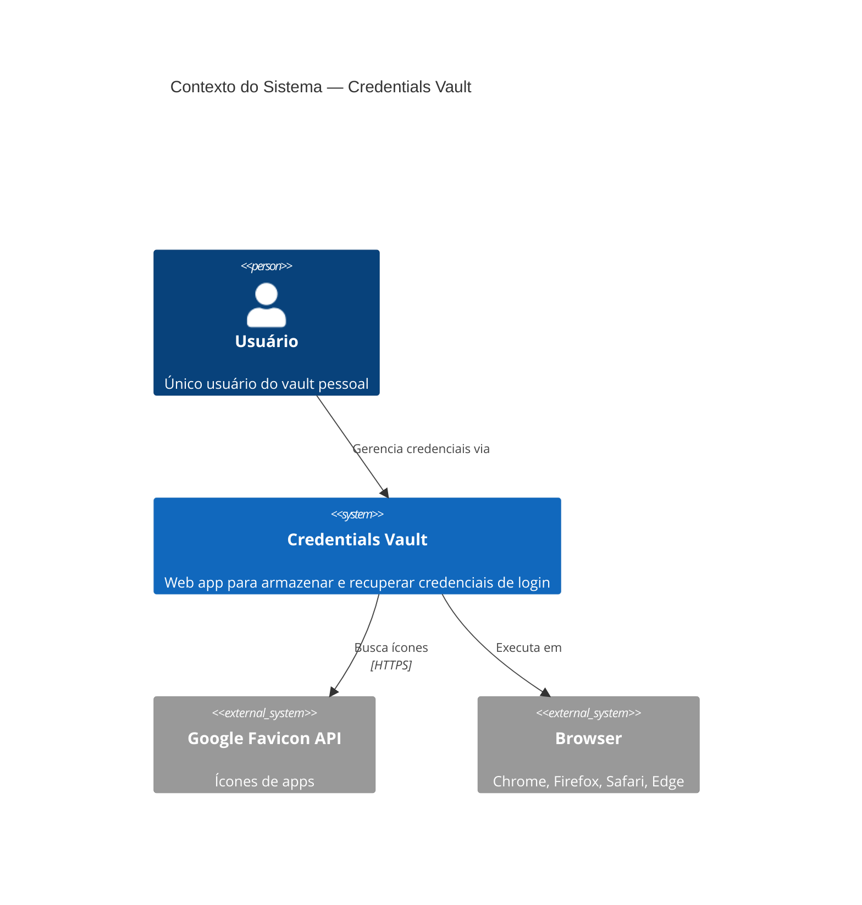
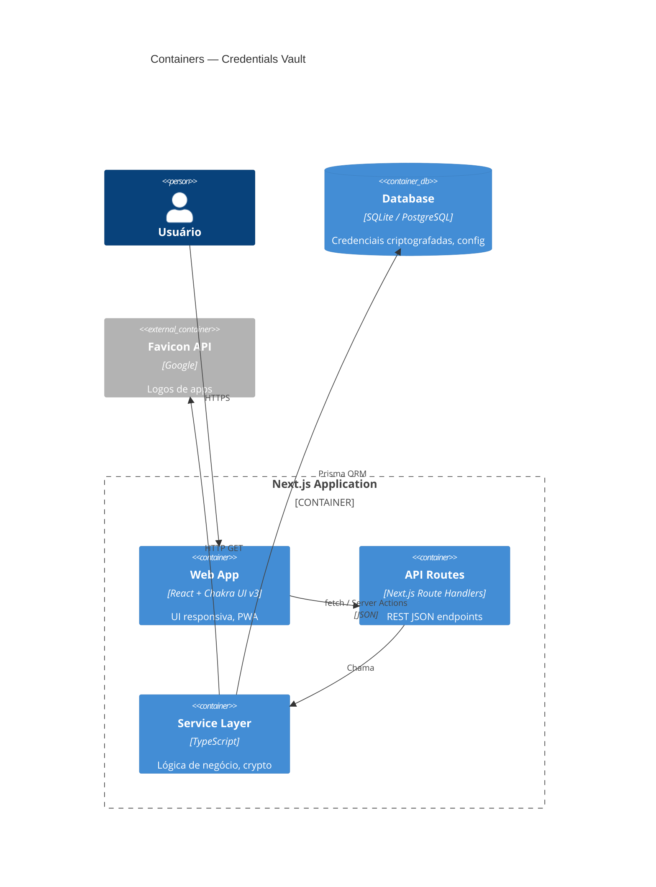
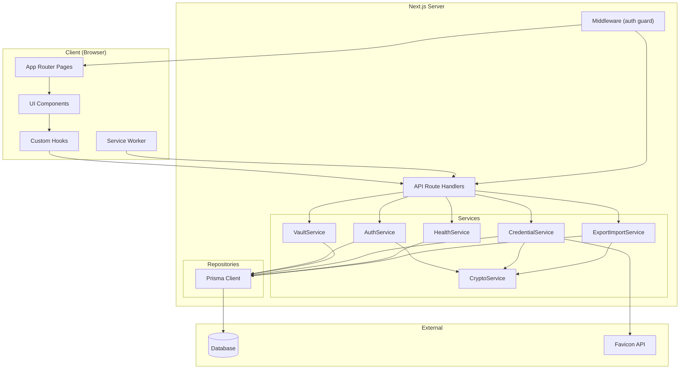
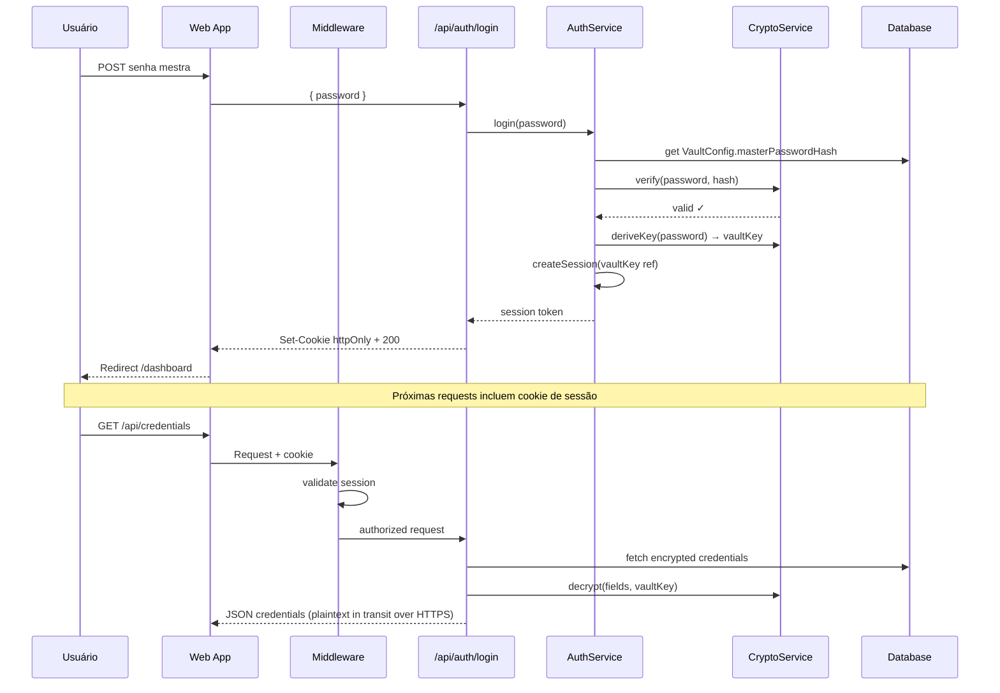
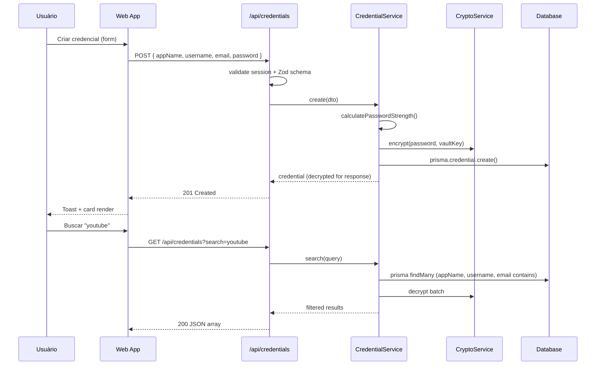
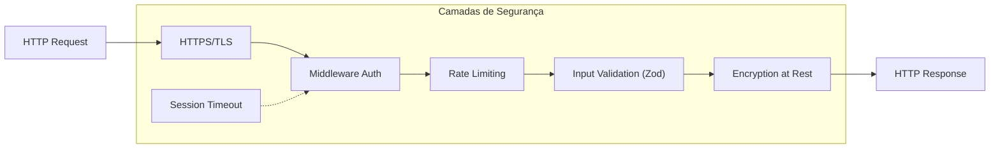
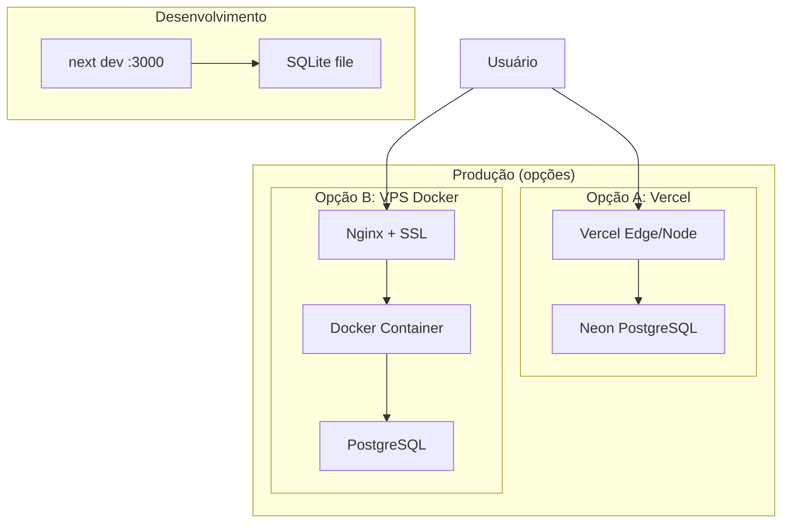
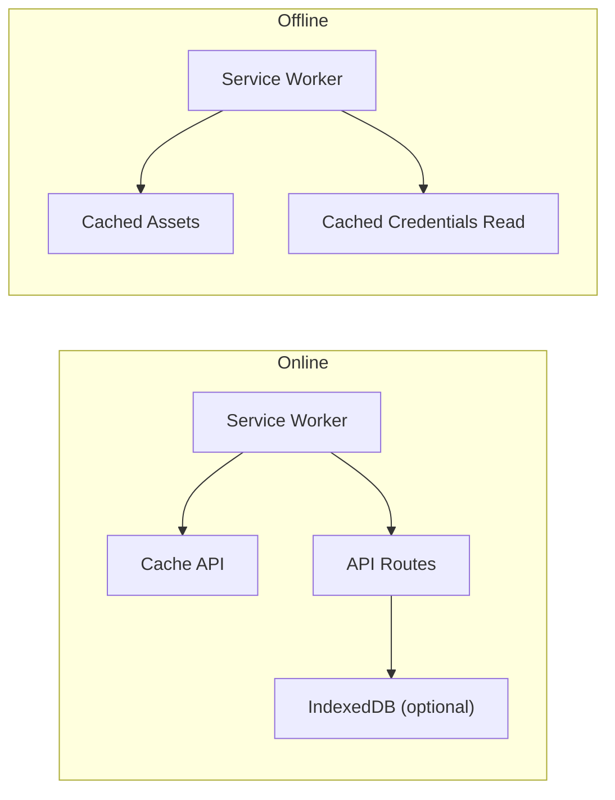

# Diagramas de Arquitetura — Credentials Vault

**Projeto:** Gerenciador de Credenciais Pessoal  
**Data:** 2026-05-26  
**Agente:** Arquiteto de Software  
**Versão:** 1.0

---

## 1. Visão Geral

Sistema **monolítico fullstack** baseado em Next.js App Router, com API Routes como camada de backend, Prisma ORM para persistência e Chakra UI v3 no frontend. Projetado para **single-user** (sem multi-tenancy), com foco em segurança, simplicidade operacional e baixo custo de infraestrutura.

### Características arquiteturais

| Aspecto | Decisão |
|---------|---------|
| Estilo | Monolito modular (Next.js fullstack) |
| Usuários | Single-user (vault singleton) |
| Deploy | Single container / Vercel / VPS |
| Banco | SQLite (dev) / PostgreSQL (prod) |
| Auth | Senha mestra + sessão httpOnly |
| Criptografia | AES-256-GCM em repouso |

---

## 2. Diagrama de Contexto (C4 — Level 1)



---

## 3. Diagrama de Containers (C4 — Level 2)



---

## 4. Diagrama de Componentes (C4 — Level 3)



---

## 5. Fluxo de Dados — Autenticação



---

## 6. Fluxo de Dados — CRUD Credencial



---

## 7. Arquitetura de Segurança



### Modelo de criptografia

```
Senha Mestra (usuário)
        │
        ▼ Argon2id hash ──────────► VaultConfig.masterPasswordHash (storage)
        │
        ▼ PBKDF2/Argon2 derive ───► Vault Key (256-bit, em memória/sessão)
                                        │
                    ┌───────────────────┼───────────────────┐
                    ▼                   ▼                   ▼
            encrypt(password)   encrypt(customFields)  encrypt(export)
                    │                   │                   │
                    ▼                   ▼                   ▼
              AES-256-GCM         AES-256-GCM          AES-256-GCM
              (Credential)        (JSON blob)          (.vault.json)
```

**Regras:**
- Senha mestra **nunca** persistida em plain text
- Vault Key **nunca** enviada ao client — descriptografia no server
- Campos sensíveis (`password`, `customFields` com PIN/backup) criptografados
- Metadados (`appName`, `username`, `email`, `category`) em plain text para busca eficiente

---

## 8. Mapa de API Routes

| Método | Rota | Auth | Descrição |
|--------|------|------|-----------|
| GET | `/api/vault/status` | Não | `{ configured: boolean }` |
| POST | `/api/vault/setup` | Não | Criar senha mestra (1x) |
| POST | `/api/auth/login` | Não | Login com senha mestra |
| POST | `/api/auth/logout` | Sim | Encerrar sessão |
| POST | `/api/auth/lock` | Sim | Bloquear vault |
| GET | `/api/vault/config` | Sim | Config (tema, timeout) |
| PATCH | `/api/vault/config` | Sim | Atualizar config |
| GET | `/api/credentials` | Sim | Listar (+ query params) |
| POST | `/api/credentials` | Sim | Criar credencial |
| GET | `/api/credentials/[id]` | Sim | Detalhe |
| PUT | `/api/credentials/[id]` | Sim | Atualizar |
| DELETE | `/api/credentials/[id]` | Sim | Excluir |
| GET | `/api/vault/health` | Sim | Score de saúde |
| POST | `/api/vault/export` | Sim | Exportar vault |
| POST | `/api/vault/import` | Sim | Importar vault |
| GET | `/api/favicon` | Sim | Proxy favicon (evita CORS) |

### Query params — GET `/api/credentials`

| Param | Tipo | Descrição |
|-------|------|-----------|
| `search` | string | Busca global |
| `appName` | string | Filtro |
| `username` | string | Filtro |
| `email` | string | Filtro |
| `category` | enum | Filtro |
| `favorite` | boolean | Apenas favoritos |
| `sort` | string | `updatedAt`, `appName`, `createdAt` |
| `limit` | number | Paginação |
| `offset` | number | Paginação |

---

## 9. Estrutura de Páginas (App Router)

```
app/
├── layout.tsx              # Root layout + Chakra Provider
├── page.tsx                # Redirect → /dashboard ou /login
├── setup/
│   └── page.tsx            # Primeiro acesso
├── login/
│   └── page.tsx            # Login
├── (authenticated)/        # Route group com layout auth
│   ├── layout.tsx          # Sidebar + header + auth guard
│   ├── dashboard/
│   │   └── page.tsx
│   ├── credentials/
│   │   └── page.tsx
│   ├── health/
│   │   └── page.tsx
│   └── settings/
│       └── page.tsx
└── api/
    ├── vault/
    ├── auth/
    ├── credentials/
    └── favicon/
```

---

## 10. Diagrama de Deploy



**Recomendação:** Vercel + Neon (free tier) para simplicidade, ou Docker Compose em VPS para controle total.

---

## 11. PWA — Arquitetura Offline (Release 1.5)



**Estratégia:**
- **Assets estáticos:** Cache-first (app shell)
- **API GET credentials:** Network-first, fallback cache (read-only offline)
- **API mutations offline:** Queue in IndexedDB, sync on reconnect (Release 1.5)

---

## 12. Integrações Externas

| Serviço | Direção | Protocolo | Fallback |
|---------|---------|-----------|----------|
| Google Favicon | Server → External | HTTPS GET | Avatar com inicial |
| Clearbit Logo | Server → External | HTTPS GET | Favicon API |

**Proxy interno:** `/api/favicon?domain=youtube.com` — evita CORS no client e centraliza cache.

---

## 13. Limites e Escalabilidade

| Dimensão | Capacidade | Notas |
|----------|------------|-------|
| Usuários | 1 | By design |
| Credenciais | 500+ | Index em appName, username, email |
| Requests/s | ~10 | Uso pessoal |
| Storage | < 10 MB | Texto criptografado |
| Concurrent sessions | 1-3 abas | Shared session cookie |

Não requer microserviços, load balancer ou cache distribuído para o escopo atual.

---

## 14. Referências

- `outputs/product-owner/requirements.md`
- `outputs/product-owner/acceptance-criteria.md`
- `outputs/ux/design-system.md`
