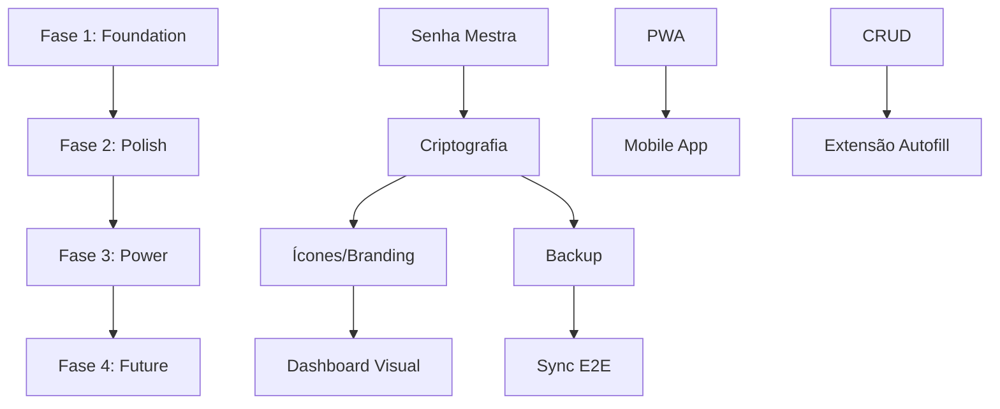

# Feature Roadmap — Gerenciador de Credenciais Pessoal

**Projeto:** Sistema web para armazenamento pessoal de credenciais  
**Data:** 2026-05-26  
**Agente:** Feature Suggester

---

## Visão Geral do Roadmap

```
Fase 1 ──────► Fase 2 ──────► Fase 3 ──────► Fase 4
Foundation     Polish &         Power           Future
(MVP+)         Delight          Features        Vision
~2-3 sem       ~2-3 sem         ~4-6 sem        ~8+ sem
```

**Princípio guia:** Entregar valor visual e funcional cedo; complexidade de segurança avançada e extensões depois.

---

## Fase 1: Foundation (MVP+)

**Objetivo:** Transformar o CRUD existente em um vault utilizável e seguro no dia a dia.

**Duração estimada:** 2-3 semanas

### Features

| # | Feature | Prioridade | Esforço | Dependências |
|---|---------|------------|---------|--------------|
| 1 | Autenticação com senha mestra | P1 | Médio | — |
| 2 | Criptografia de dados em repouso | P1 | Médio | Senha mestra |
| 3 | Copiar com um clique (usuário, email, senha) | P1 | Baixo | — |
| 4 | Visualização segura de senha (toggle show/hide) | P1 | Baixo | — |
| 5 | Busca global instantânea | P1 | Baixo | — |
| 6 | Dashboard com visão geral | P1 | Médio | CRUD existente |

### Entregáveis

- [ ] Tela de login com senha mestra
- [ ] Vault criptografado (AES-256 via Web Crypto API)
- [ ] Botões de copy em cada credencial
- [ ] Campo senha com toggle visibility
- [ ] Barra de busca com filtro em tempo real
- [ ] Dashboard: total de credenciais + últimas modificadas

### Critérios de Conclusão

- Usuário consegue adicionar, buscar e copiar credencial em < 10 segundos
- Senhas nunca aparecem em plain text sem ação explícita
- Sessão expira após inatividade configurável

### Stack Sugerida

- Frontend: React/Vue + Tailwind/shadcn
- Storage: IndexedDB criptografado ou SQLite WASM
- Crypto: Web Crypto API (PBKDF2 + AES-GCM)

---

## Fase 2: Polish & Delight

**Objetivo:** Elevar a experiência visual e organizacional ao nível "profissional e bonito".

**Duração estimada:** 2-3 semanas

### Features

| # | Feature | Prioridade | Esforço | Dependências |
|---|---------|------------|---------|--------------|
| 7 | Ícones e branding automático dos apps | P1 | Médio | CRUD |
| 8 | Modo escuro e temas personalizáveis | P1 | Baixo | UI base |
| 9 | Categorização por tipo de serviço | P2 | Médio | CRUD |
| 10 | Favoritos e acesso rápido | P2 | Baixo | Dashboard |
| 11 | Animações e microinterações | P2 | Baixo | UI base |
| 12 | Avaliador de saúde das senhas | P2 | Médio | Senhas existentes |

### Entregáveis

- [ ] Cards visuais com logo do app (favicon API + fallback)
- [ ] Toggle dark/light + accent color
- [ ] Tags: Redes Sociais, Streaming, Email, Bancos, Trabalho, Outros
- [ ] Seção "Favoritos" no dashboard
- [ ] Transições suaves + toast ao copiar
- [ ] Painel "Vault Health" com score e alertas

### Critérios de Conclusão

- Interface comparável visualmente a um password manager comercial
- Usuário identifica credencial pelo ícone em < 1 segundo
- Dark mode funcional sem bugs visuais
- Health score calculado para 100% das credenciais

### Milestone: v1.0 Release

Com a conclusão da Fase 2, o produto atinge o objetivo declarado:

> *"Sistema intuitivo, moderno, bonito e profissional para lembrar credenciais"*

---

## Fase 3: Power Features

**Objetivo:** Adicionar funcionalidades avançadas que transformam o vault em ferramenta completa.

**Duração estimada:** 4-6 semanas

### Features

| # | Feature | Prioridade | Esforço | Dependências |
|---|---------|------------|---------|--------------|
| 13 | Campos customizáveis por credencial | P2 | Médio | CRUD |
| 14 | Exportação e backup seguro | P2 | Médio | Criptografia |
| 15 | Importação de CSV/JSON | P2 | Médio | Export |
| 16 | Modo privacidade / Panic button | P3 | Baixo | UI |
| 17 | PWA offline-first | P2 | Médio | Service Worker |
| 18 | Histórico de alterações de senha | P3 | Médio | CRUD |

### Entregáveis

- [ ] Campos extras: URL, notas, PIN, backup codes
- [ ] Export JSON criptografado + CSV plain (com confirmação)
- [ ] Import com preview e merge
- [ ] Atalho Ctrl+H oculta vault instantaneamente
- [ ] App instalável como PWA, funciona offline
- [ ] Log de "senha alterada em DD/MM/YYYY"

### Critérios de Conclusão

- Backup/restore completo testado
- PWA instalável em desktop e mobile
- Zero perda de dados em cenário offline → online

---

## Fase 4: Future Vision

**Objetivo:** Evoluir para credential manager completo com tecnologias emergentes.

**Duração estimada:** 8+ semanas (contínuo)

### Features

| # | Feature | Prioridade | Esforço | Dependências |
|---|---------|------------|---------|--------------|
| 19 | Autofill via extensão de browser | P3 | Alto | API vault |
| 20 | Gerador TOTP (autenticador 2FA) | P3 | Alto | Criptografia |
| 21 | Suporte a Passkeys (WebAuthn) | P3 | Alto | Arquitetura |
| 22 | Sync multi-dispositivo E2E | P3 | Alto | Backend |
| 23 | Dark web monitoring (Have I Been Pwned) | P3 | Médio | API externa |
| 24 | App mobile nativo (React Native) | P3 | Alto | Sync |

### Entregáveis

- [ ] Extensão Chrome/Firefox com autofill
- [ ] TOTP integrado por credencial
- [ ] Armazenamento de passkeys
- [ ] Sync encrypted entre dispositivos
- [ ] Alertas de breach por email/senha
- [ ] App iOS/Android (opcional)

### Critérios de Conclusão

- Login em site suportado com 1 clique via extensão
- 2FA gerado dentro do vault
- Sync funcional entre 2+ dispositivos

---

## Timeline Visual

```
2026
─────────────────────────────────────────────────────────────────
     Jun         Jul         Ago         Set         Out+
     │           │           │           │           │
     ├─ Fase 1 ──┤           │           │           │
     │  MVP+     │           │           │           │
     │           ├─ Fase 2 ──┤           │           │
     │           │  Polish   │           │           │
     │           │           ├─ Fase 3 ──┤           │
     │           │           │  Power    │           │
     │           │           │           ├─ Fase 4 ──┤
     │           │           │           │  Future   │
     ▼           ▼           ▼           ▼           ▼
   v0.5        v1.0        v1.5        v2.0        v3.0
```

---

## Dependências Entre Fases



---

## Riscos por Fase

| Fase | Risco | Probabilidade | Impacto | Mitigação |
|------|-------|---------------|---------|-----------|
| 1 | Complexidade de crypto | Média | Alto | Usar libs battle-tested (libsodium.js) |
| 1 | Perda de senha mestra | Alta | Crítico | Backup reminder + export early |
| 2 | API de ícones indisponível | Baixa | Baixo | Fallback para iniciais coloridas |
| 3 | Import corrompe dados | Média | Alto | Preview + rollback |
| 4 | Extensão rejeitada nas stores | Média | Médio | Distribuição manual (.crx) |
| 4 | Sync E2E complexo | Alta | Alto | Postergar; local-first suficiente |

---

## Métricas de Sucesso por Fase

| Fase | Métrica | Target |
|------|---------|--------|
| 1 | Tempo para copiar credencial | < 5 seg |
| 1 | Credenciais armazenadas com segurança | 100% |
| 2 | Satisfação visual (autoavaliação) | 8/10+ |
| 2 | Uso diário consistente | 30+ dias |
| 3 | Backup realizado | ≥ 1x/mês |
| 3 | Funciona offline | 100% read |
| 4 | Autofill em sites testados | 80%+ |
| 4 | Sync entre dispositivos | < 5 seg |

---

## Recomendação de Início Imediato

**Começar pela Fase 1, items 3-5** (copy, toggle, busca) — baixo esforço, alto impacto visual imediato, sem dependência de crypto. Em paralelo, implementar senha mestra (items 1-2) como gate de segurança.

Ordem sugerida de implementação:

1. Copiar com um clique
2. Toggle show/hide senha
3. Busca global instantânea
4. Dashboard básico
5. Senha mestra + criptografia
6. → Iniciar Fase 2

---

## Conclusão

O roadmap equilibra **valor rápido** (Fases 1-2) com **ambição futura** (Fases 3-4). A v1.0 na conclusão da Fase 2 já cumpre o objetivo do usuário. Fases subsequentes são evolução opcional conforme necessidade.
