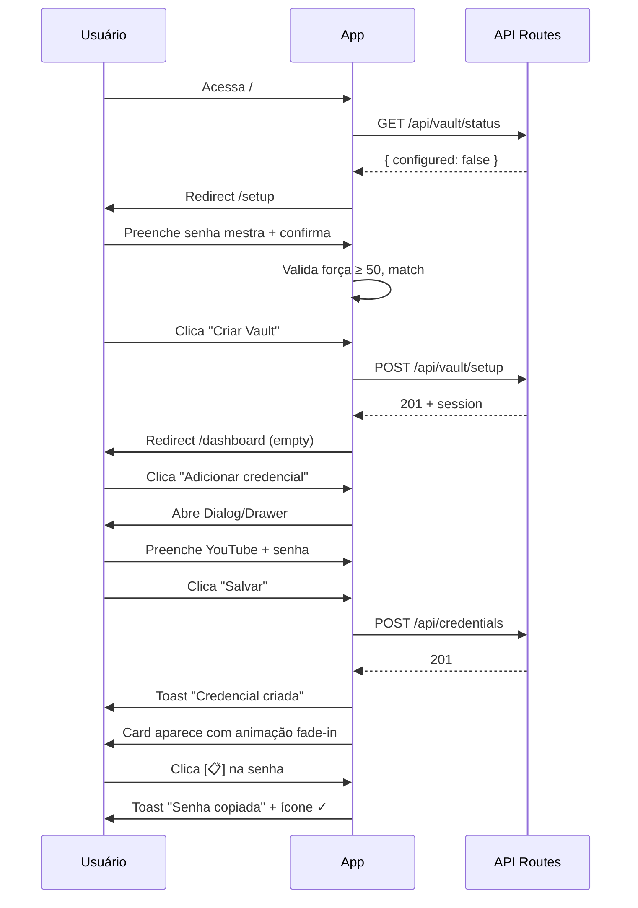
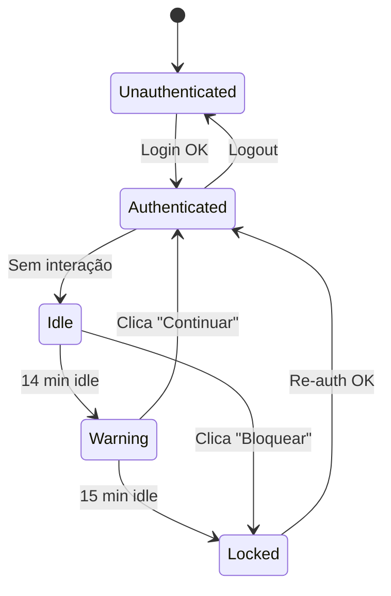

# Protótipos — Fluxos de Interação

**Projeto:** Credentials Vault  
**Data:** 2026-05-26

---

## PF-01: Onboarding

**Objetivo:** Usuário cria vault e adiciona 1ª credencial em ≤ 60s  
**Stories:** US-001, US-005, US-017



**Microinterações:**
1. Strength bar anima conforme digitação (150ms width transition)
2. Ícone app preview fade-in ao digitar appName (debounce 500ms → fetch favicon)
3. Card novo entra com `opacity 0→1` + `translateY 8px→0` (200ms)

---

## PF-02: Login e Sessão

**Stories:** US-002, US-004, US-003



**Interações:**
| Evento | Feedback |
|--------|----------|
| Login OK | Redirect dashboard, sem flash |
| Login fail | Shake no form + "Senha incorreta" |
| 5 fails | Countdown "Tente em 4:59" |
| 1 min warning | Banner bottom amarelo |
| Lock manual | Transição blur 200ms → overlay login |

---

## PF-03: Buscar e Copiar

**Objetivo:** Copiar senha em ≤ 5s total  
**Stories:** US-015, US-017, US-018

```
[Usuário autenticado no dashboard]
        │
        ▼
[Ctrl+K ou clica busca] ──→ Input focused, cursor ready
        │
        ▼
[Digita "yout"] ──→ debounce 300ms ──→ API/local filter
        │
        ▼
[Lista filtra para 1-2 cards] ──→ highlight "yout" em amarelo
        │
        ▼
[Clica 📋 na senha] ──→ clipboard.writeText()
        │
        ├──→ Ícone 📋 → ✓ (2s)
        └──→ Toast "Senha copiada" (3s, dismissable)
```

**Atalhos de teclado:**
| Atalho | Ação |
|--------|------|
| `Ctrl+K` / `/` | Focar busca |
| `Esc` | Limpar busca / fechar modal |
| `Ctrl+H` | Panic mode |
| `Ctrl+L` | Bloquear vault |
| `Enter` | Submit form ativo |

---

## PF-04: CRUD Credencial

**Stories:** US-005 a US-008, US-010, US-011

### Criar
1. Click "+ Nova" → Dialog open (focus appName)
2. Tab order: appName → category → url → username → email → password
3. "Gerar" → password preenchido + strength verde
4. "Salvar" → loading button → success toast → dialog close → list update

### Editar
1. Click "Editar" no card → Dialog pre-filled
2. Alterar senha → strength recalcula
3. Salvar → toast "Atualizada" → card refresh in-place

### Excluir
1. Click "Excluir" → AlertDialog
2. Confirmar → card fade-out 150ms → remove from DOM → toast

---

## PF-05: Favoritos

**Stories:** US-013

```
Click [☆] no card
  → Optimistic UI: ☆ → ★ imediato
  → API PATCH /credentials/:id { isFavorite: true }
  → Se erro: revert ★ → ☆ + toast error
  → Dashboard seção Favoritos atualiza
```

**Regra:** Favoritos aparecem primeiro na seção dedicada; ordenação alfabética por appName.

---

## PF-06: Tema Claro/Escuro

**Stories:** US-020, US-021

```
Click [🌙] no header
  → Cycle: light → dark → system
  → Chakra colorMode.set(colorMode)
  → CSS transition 200ms em bg/color
  → Persist: PATCH /api/vault/config { theme }
  → Tooltip: "Tema: Escuro"
```

**System mode:** `matchMedia('prefers-color-scheme')` listener atualiza em tempo real.

---

## PF-07: Vault Health

**Stories:** US-026, US-027, US-028

```
Dashboard widget "78/100" click
  → Navigate /health
  → Lista senhas fracas
  → Click "Melhorar" em YouTube
  → Dialog edit com password gerado
  → Salvar → redirect /health com score atualizado (animado 78→85)
```

**Animação score:** Count-up 500ms ease-out ao recalcular.

---

## PF-08: Export / Import

**Stories:** US-029, US-031

### Export
```
Settings → Exportar → Dialog
  → Seleciona JSON criptografado
  → Digita senha mestra
  → Valida → gera blob → download automático
  → Toast "Export concluído"
```

### Import
```
Settings → Importar → Upload file
  → Parse + validate
  → Preview table com checkboxes
  → Seleciona merge/replace
  → Confirma → progress bar
  → Relatório: "10 criadas, 2 ignoradas"
```

---

## PF-09: Panic Mode

**Stories:** US-033

```
Ctrl+H (qualquer página autenticada)
  → Todas passwords: text → ••••••
  → Todos eye icons: open → closed
  → Optional overlay escuro 80% opacity
  → Toast discreto "Vault oculto"
  → Click anywhere ou Esc → remove overlay (senhas permanecem ocultas)
```

---

## PF-10: PWA Offline

**Stories:** US-032

```
Primeira visita autenticada
  → Banner "Instalar app" (dismissable)
  → Service worker registra
  → Offline: banner top "Modo offline"
  → Credenciais: read from cache/IndexedDB
  → CRUD offline: queue sync (optimistic)
  → Online again: sync + toast "Sincronizado"
```

---

## Matriz Fluxo × Breakpoint

| Fluxo | Desktop | Tablet | Mobile |
|-------|---------|--------|--------|
| PF-01 Onboarding | Dialog center | Dialog center | Drawer bottom |
| PF-03 Busca+copy | Header search | Header search | Header + list |
| PF-04 CRUD | Modal | Modal | Full drawer |
| PF-05 Favoritos | Sidebar section | Grid cards | Horizontal scroll |
| PF-08 Import | Modal wide | Modal | Full page steps |
