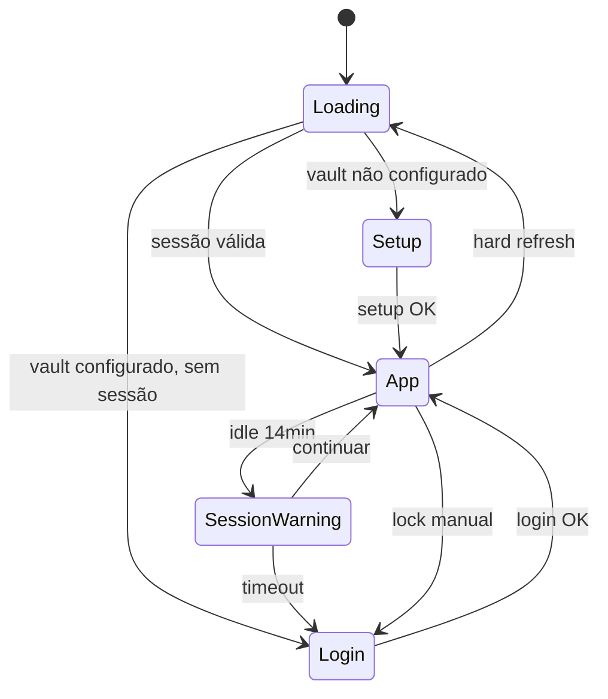

# Protótipos — Estados e Transições

**Projeto:** Credentials Vault  
**Data:** 2026-05-26

---

## 1. Estados Globais da Aplicação

---

## 2. Estados por Tela

### 2.1 Dashboard

| Estado | Condição | UI |
|--------|----------|-----|
| `loading` | Fetch credentials | Skeleton cards (3 placeholders) |
| `empty` | 0 credentials | Ilustração + CTA "Adicionar" |
| `populated` | ≥1 credential | Stats + favoritos + recentes |
| `error` | API fail | Alert + botão "Tentar novamente" |

### 2.2 Lista de Credenciais

| Estado | Condição | UI |
|--------|----------|-----|
| `loading` | Fetch | Skeleton grid |
| `loaded` | Dados OK | Grid/lista de cards |
| `filtering` | Busca/filtro ativo | Spinner inline na busca |
| `empty-filter` | 0 resultados | "Nenhuma credencial encontrada" |
| `empty` | Vault vazio | Redirect ou CTA dashboard |

### 2.3 Formulário Credencial

| Estado | Condição | UI |
|--------|----------|-----|
| `pristine` | Sem alterações | Salvar disabled |
| `dirty` | Campos alterados | Salvar enabled |
| `validating` | Submit em progresso | Button loading |
| `error` | Validação/API fail | Inline errors + toast |
| `success` | Save OK | Toast + close |

### 2.4 Login / Setup

| Estado | Condição | UI |
|--------|----------|-----|
| `idle` | Aguardando input | Form normal |
| `invalid` | Validação fail | Inline errors |
| `submitting` | Request | Button spinner |
| `error` | Auth fail | Shake + message |
| `locked` | Rate limit | Countdown timer |

---

## 3. Estados do Credential Card

| Elemento | Estados | Transição |
|----------|---------|-----------|
| Password | hidden / visible | Click 👁 toggle |
| Copy btn | default / copied | Click → ✓ 2s → default |
| Favorite | inactive / active | Click ☆ ↔ ★ |
| Card | default / hover / focus | CSS hover + keyboard focus |
| Strength badge | weak / medium / strong | Cor dinâmica |

---

## 4. Transições de Navegação

| De | Para | Animação | Duração |
|----|------|----------|---------|
| Login | Dashboard | Fade in content | 200ms |
| Dashboard | Credentials | Slide left (mobile) | 150ms |
| Any | Settings | Fade | 150ms |
| Open modal | — | Scale 0.95→1 + fade | 200ms |
| Close modal | — | Fade out | 150ms |
| Open drawer (mobile) | — | Slide up from bottom | 250ms |
| Close drawer | — | Slide down | 200ms |

**Reduced motion:** Todas transições → fade instantâneo (0ms slide/scale).

---

## 5. Feedback Visual (Toasts)

| Ação | Tipo | Mensagem | Duração |
|------|------|----------|---------|
| Copy username | success | "Usuário copiado" | 3s |
| Copy email | success | "Email copiado" | 3s |
| Copy password | success | "Senha copiada" | 3s |
| Create credential | success | "Credencial criada" | 3s |
| Update credential | success | "Credencial atualizada" | 3s |
| Delete credential | success | "Credencial excluída" | 3s |
| Export done | success | "Export concluído" | 4s |
| Import done | success | "10 credenciais importadas" | 4s |
| API error | error | "Erro ao salvar. Tente novamente." | 5s |
| Session warning | warning | "Sessão expira em 1 min" | persistent |
| Offline | info | "Modo offline" | persistent |

**Posicionamento Chakra Toaster:**
- Desktop: `bottom-end`
- Mobile: `bottom-center`

---

## 6. Loading Patterns

| Contexto | Pattern |
|----------|---------|
| Page load | Full page skeleton |
| Search | Inline spinner no input (right) |
| Save credential | Button `loading` prop |
| Export | Progress bar no dialog |
| Import | Step indicator 1→2→3 |
| Favicon fetch | Avatar skeleton → image fade-in |

---

## 7. Empty States

| Tela | Ilustração | Título | CTA |
|------|------------|--------|-----|
| Dashboard | 🔑 key icon | "Vault vazio" | "Adicionar credencial" |
| Credentials | 🔍 | "Nenhuma credencial" | "Adicionar credencial" |
| Search | 🔍 | "Nenhum resultado para 'x'" | "Limpar busca" |
| Favoritos | ★ outline | "Nenhum favorito" | "Explore credenciais" |
| Health (100) | 🛡 green | "Vault saudável!" | — |

---

## 8. Error States

| Erro | UI | Recovery |
|------|-----|----------|
| Network fail | Alert banner top | "Tentar novamente" |
| 401 session | Overlay login | Re-authenticate |
| 404 credential | Toast error | Redirect list |
| 429 rate limit | Inline countdown | Wait |
| Validation | Field-level red border | Fix input |
| Import parse fail | Dialog error detail | Re-upload |

---

## 9. Responsividade — Mudanças de Estado

| Breakpoint change | Behavior |
|-------------------|----------|
| D → T | Sidebar collapse; grid 4→2 cols |
| T → M | Sidebar → drawer; grid → list; modal → drawer |
| M → T | Drawer → modal; bottom nav persists |
| Rotation | Recalculate grid; no data loss |

**Form open on resize:** Se modal aberto e resize para mobile → converter para drawer sem perder dados (same React state).

---

## 10. Z-Index Stack

| Layer | z-index | Elemento |
|-------|---------|------------|
| Base | 0 | Content |
| Sticky header | 100 | Search bar |
| Sidebar | 200 | Navigation |
| Dropdown | 300 | Filters, selects |
| Modal/Drawer | 400 | CRUD forms |
| Toast | 500 | Notifications |
| Session overlay | 600 | Re-auth |
| Panic overlay | 700 | Privacy mode |

---

## 11. Checklist de Estados para Frontend

- [ ] Loading skeleton em dashboard e lista
- [ ] Empty states com CTA
- [ ] Error boundary global
- [ ] Toast system configurado
- [ ] Session timeout com warning
- [ ] Copy feedback (icon + toast)
- [ ] Form dirty/ pristine tracking
- [ ] Optimistic UI em favoritos
- [ ] prefers-reduced-motion respeitado
- [ ] Offline banner (PWA)
