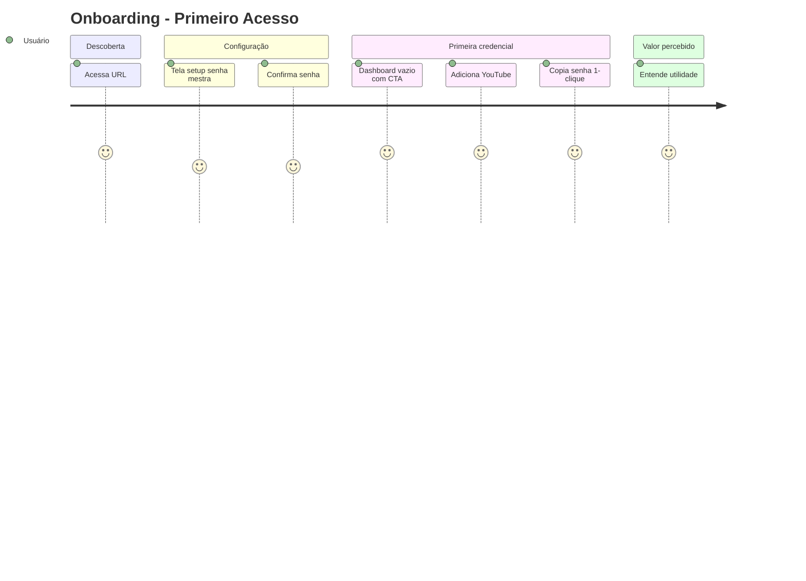

# Pesquisa de Usuário — Credentials Vault

**Projeto:** Gerenciador de Credenciais Pessoal  
**Data:** 2026-05-26  
**Agente:** UX Designer  
**Base:** Outputs do Product Owner (`requirements.md`, `user-stories.md`, `backlog.md`)

---

## 1. Objetivo da Pesquisa

Validar hipóteses de experiência para um vault pessoal web que seja **intuitivo, moderno, bonito e profissional**, substituindo planilhas e password managers genéricos para uso individual.

### Perguntas de pesquisa

1. Como o usuário organiza e recupera credenciais hoje?
2. Quais fricções impedem uso diário de ferramentas existentes?
3. O que define "bonito e profissional" neste contexto?
4. Quais fluxos devem ser mais rápidos que qualquer alternativa?
5. Como o uso muda entre desktop e mobile?

---

## 2. Metodologia

| Método | Aplicação |
|--------|-----------|
| **Análise de requisitos** | Síntese dos outputs do Product Owner |
| **Desk research** | Benchmark Bitwarden, 1Password, KeePass, planilhas |
| **Personas** | Derivadas de stakeholder único (Tiago) + contexto mobile |
| **Journey mapping** | 3 jornadas críticas documentadas |
| **Hipóteses UX** | 8 hipóteses com critérios de validação |
| **Entrevista conceitual** | Roteiro para validação futura com o próprio usuário |

> Nota: Pesquisa primária qualitativa planejada pós-MVP com o stakeholder como único participante (N=1, uso pessoal).

---

## 3. Personas

### Persona Primária: Tiago — Guardião do Vault

| Dimensão | Detalhe |
|----------|---------|
| **Idade** | 28-38 anos |
| **Ocupação** | Desenvolvedor de software |
| **Contexto** | Uso 100% pessoal; 30-80 contas digitais |
| **Apps frequentes** | YouTube, Facebook, Twitter/X, Gmail, bancos, SaaS |
| **Tech literacy** | Alta |
| **Dispositivos** | Desktop (trabalho), smartphone (uso casual) |

**Objetivos:**
- Encontrar credencial em < 5 segundos
- Sentir que os dados estão seguros
- Usar interface que dá prazer visual

**Frustrações:**
- Planilha no Drive = inseguro e feio
- Bitwarden = funcional mas visual genérico
- 1Password = bonito mas pago e com features de família desnecessárias
- Anotar senha no bloco de notas = caótico

**Comportamentos:**
- Acessa vault 3-10x por dia
- Copia senha mais que usuário/email
- Prefere dark mode à noite
- Evita digitar senha mestra repetidamente (quer sessão estável)

**Citação representativa:**
> *"Quero abrir, achar o YouTube e copiar a senha sem pensar. Se for mais lento que a planilha, não uso."*

---

### Persona Secundária: Tiago Mobile — Login em Movimento

| Dimensão | Detalhe |
|----------|---------|
| **Contexto** | Celular na mão, precisa logar em app nativo |
| **Dispositivo** | Smartphone 375-430px |
| **Urgência** | Alta — quer credencial em < 10 seg total |

**Necessidades específicas:**
- Touch targets grandes (≥ 44px)
- Copy com feedback tátil/visual imediato
- Busca acessível sem scroll excessivo
- Teclado não cobre botões de ação

**Frustrações mobile:**
- Tabelas/planilhas ilegíveis no celular
- Password managers com UI desktop espremida
- Múltiplos toques para copiar um campo

---

## 4. Jornadas do Usuário

### 4.1 Jornada: Onboarding (Primeiro Acesso)



| Etapa | Touchpoint | Pensamento | Emoção | Oportunidade UX |
|-------|------------|------------|--------|-----------------|
| 1 | Landing → redirect setup | "Será complicado?" | Curiosidade | Copy tranquilizador: "Leva menos de 1 minuto" |
| 2 | Form senha mestra | "Preciso lembrar essa senha" | Cautela | Indicador de força + dica de backup |
| 3 | Dashboard empty | "E agora?" | Orientação | Empty state com CTA "Adicione sua primeira credencial" |
| 4 | Modal nova credencial | "Fácil como esperava" | Satisfação | Ícone preview ao digitar app |
| 5 | Copy senha | "Isso é rápido!" | Encantamento | Toast + animação no botão copy |

**Meta:** Onboarding completo em ≤ 60 segundos (RNF-UX-01)

---

### 4.2 Jornada: Uso Diário (Copiar Credencial)

| Etapa | Ação | Tempo target | Touchpoint |
|-------|------|--------------|------------|
| 1 | Abre app / desbloqueia | < 3s | Login ou sessão ativa |
| 2 | Busca "youtube" | < 2s | Busca global no header |
| 3 | Identifica card | < 1s | Ícone + nome do app |
| 4 | Copia senha | < 1s | Botão copy no card |
| 5 | Cola no serviço | — | App externo |

**Pontos de dor atuais (sem UX definida):**
- Múltiplos cliques para copiar
- Senha visível por padrão
- Sem busca global unificada

**Solução UX:**
- Busca persistente no header
- Cards com hierarquia: ícone > app > campos > ações
- Copy inline sem abrir detalhe

---

### 4.3 Jornada: Manutenção (Saúde do Vault)

| Etapa | Ação | Touchpoint |
|-------|------|------------|
| 1 | Abre dashboard | Widget "Vault Health" |
| 2 | Vê score 65/100 | Cor amarela, alertas |
| 3 | Clica "3 senhas fracas" | Lista filtrada |
| 4 | Edita credencial | Form com gerador |
| 5 | Exporta backup | Settings → Export |

---

## 5. Mapa de Dores e Necessidades

| Dor | Intensidade | Necessidade | Feature UX |
|-----|-------------|-------------|------------|
| Planilha insegura | Alta | Armazenamento seguro | Senha mestra + criptografia |
| Busca lenta | Alta | Encontrar em segundos | Busca global instantânea |
| Copy manual | Alta | 1 clique para copiar | Botões copy por campo |
| UI feia | Média | Visual premium | Ícones, dark mode, animações |
| Senhas fracas | Média | Consciência de segurança | Health score panel |
| Perda de dados | Alta | Backup | Export/import |
| Privacidade em público | Média | Ocultar rapidamente | Panic button (Ctrl+H) |
| Uso no celular | Alta | Layout touch-friendly | Responsive 3 breakpoints |

---

## 6. Hipóteses UX

| ID | Hipótese | Critério de validação | Prioridade |
|----|----------|----------------------|------------|
| H1 | Busca global no header reduz tempo de busca em 70% | Task time < 5s em teste | P1 |
| H2 | Cards com ícone melhoram identificação vs lista textual | Reconhecimento < 1s | P1 |
| H3 | Copy inline elimina necessidade de abrir detalhe | ≤ 1 clique para copiar | P1 |
| H4 | Dark mode aumenta satisfação visual | Score ≥ 8/10 | P1 |
| H5 | Empty state guiado aumenta taxa de 1ª credencial | 100% no onboarding | P1 |
| H6 | Health widget motiva correção de senhas fracas | ≥ 1 correção/semana | P2 |
| H7 | Favoritos reduzem busca para apps diários | Favoritos = 80% dos copies | P2 |
| H8 | Bottom nav mobile acelera navegação | Task time mobile < 10s | P1 |

---

## 7. Benchmark UX

| Produto | Pontos fortes | Pontos fracos | Lição para o projeto |
|---------|---------------|---------------|----------------------|
| **1Password** | Visual premium, ícones, watchtower | Pago, features família | Referência visual |
| **Bitwarden** | Funcional, gratuito | UI genérica | Paridade funcional, superar visual |
| **KeePass** | Seguro, local | UI anos 2000 | Não replicar estética |
| **Google Password Manager** | Zero setup | Sem controle, sem branding | Simplicidade de onboarding |
| **Planilha** | Simples, familiar | Inseguro, feio mobile | Superar velocidade + segurança |

**Posicionamento UX:**
> Visual de 1Password + simplicidade de planilha + velocidade de copy em 1 clique

---

## 8. Arquitetura de Informação

```
Credentials Vault
├── Autenticação
│   ├── Setup (primeiro acesso)
│   └── Login
├── App (autenticado)
│   ├── Dashboard
│   │   ├── Resumo (stats)
│   │   ├── Favoritos
│   │   ├── Recentes
│   │   └── Vault Health (widget)
│   ├── Credenciais
│   │   ├── Lista (grid/list)
│   │   ├── Busca + Filtros
│   │   ├── Nova credencial
│   │   ├── Editar credencial
│   │   └── Detalhe (opcional)
│   └── Configurações
│       ├── Tema (claro/escuro/sistema)
│       ├── Sessão (timeout)
│       ├── Exportar / Importar
│       └── Bloquear vault
└── Estados globais
    ├── Loading
    ├── Empty
    ├── Error
    └── Sessão expirada
```

---

## 9. Princípios de Design

| # | Princípio | Aplicação |
|---|-----------|-----------|
| 1 | **Velocidade primeiro** | Ações frequentes (busca, copy) em ≤ 1 clique |
| 2 | **Segurança visível** | Senhas ocultas; feedback ao copiar; lock explícito |
| 3 | **Beleza funcional** | Ícones, espaçamento generoso, tipografia clara |
| 4 | **Progressive disclosure** | Detalhes avançados (custom fields) sob demanda |
| 5 | **Consistência** | Chakra UI v3; padrões repetíveis em todas as telas |
| 6 | **Acessível por padrão** | WCAG AA; teclado; screen readers |
| 7 | **Mobile parity** | Mesmas capacidades, layout adaptado |

---

## 10. Roteiro de Entrevista (Validação Futura)

1. Como você guarda credenciais hoje? O que funciona/não funciona?
2. Descreva a última vez que precisou de uma senha urgente. Quantos passos?
3. O que te faz confiar (ou desconfiar) de uma ferramenta?
4. Prefere lista ou cards? Por quê?
5. Usa dark mode? Em quais situações?
6. Já perdeu acesso a contas por senha esquecida?
7. Teste: encontre e copie credencial do YouTube (task test)
8. O que mudaria na interface que viu?

---

## 11. Insights e Recomendações

### Insights principais

1. **Velocidade é o critério #1** — estética só importa se copy/busca forem instantâneos
2. **Single-user elimina clutter** — sem menus de compartilhamento, admin, equipes
3. **Ícones são diferencial emocional** — reconhecimento visual > leitura de texto
4. **Mobile é cenário crítico** — não é "versão secundária"
5. **Onboarding deve ter valor em 60s** — primeira credencial + primeiro copy

### Recomendações para wireframes

- Header fixo com busca global em todas as páginas autenticadas
- Grid de cards no desktop; lista compacta no mobile
- Ações primárias (copy) sempre visíveis no card, sem hover-only
- Modal/drawer para CRUD — não página separada
- Dashboard como home, não lista crua

---

## 12. Referências

- `outputs/product-owner/requirements.md`
- `outputs/product-owner/user-stories.md`
- `outputs/feature-suggester/value-proposition.md`
